# Structure

The Application-wide structure contains three main components:

## WorkoutView

Below we expand on the `WorkoutView` component. This shows the components
contained in the `WorkoutView` component.

Here usage of the `HoverMenu` and `InputField` components are omitted for
brevity.

## StatisticView

## AccountView

## LoginView
